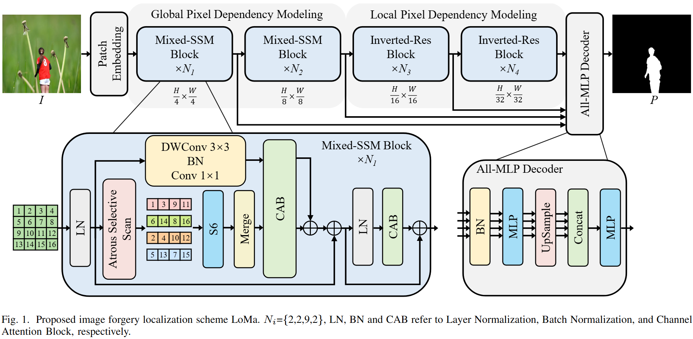

## Image Forgery Localization with State Space Models
An official implementation code for paper "[Image Forgery Localization with State Space Models.](https://ieeexplore.ieee.org/document/10959075)". This repo provide codes and trained weights.

## Framework
<p align='center'>  
  
</p>

## Dependency
- torch 1.13.1+cu117
- torchvision 0.14.1+cu117
- python 3.10
- causal-conv1d 1.0.0
- mamba-ssm 1.0.1
- selective_scan 0.0.2

## Installation
Please refer to the installation of [VMamba](https://github.com/MzeroMiko/VMamba)
## Usage

For example to train:
```bash
cd LoMa/models
python generate_npy.py
python train.py 
```

For example to test:
download [LoMa.pth](https://www.123684.com/s/2pf9-ucWHv)
```bash
cd LoMa/models
python generate_npy.py
python test.py 
```

## Citation
If you use this code for your research, please cite our paper
```
@article{lou2025image,
  title={Image Forgery Localization with State Space Models},
  author={Lou, Zijie and Cao, Gang and Guo, Kun and Weng, Shaowei and Yu, Lifang},
  journal={IEEE Signal Processing Letters},
  year={2025}
}
```
## License
Licensed under a [Creative Commons Attribution-NonCommercial 4.0 International](https://creativecommons.org/licenses/by-nc/4.0/) for Non-commercial use only.
Any commercial use should get formal permission first.
